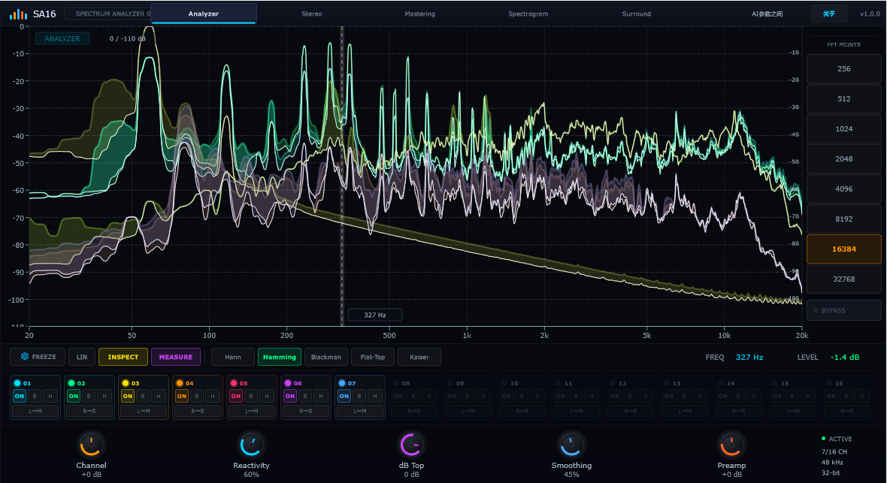
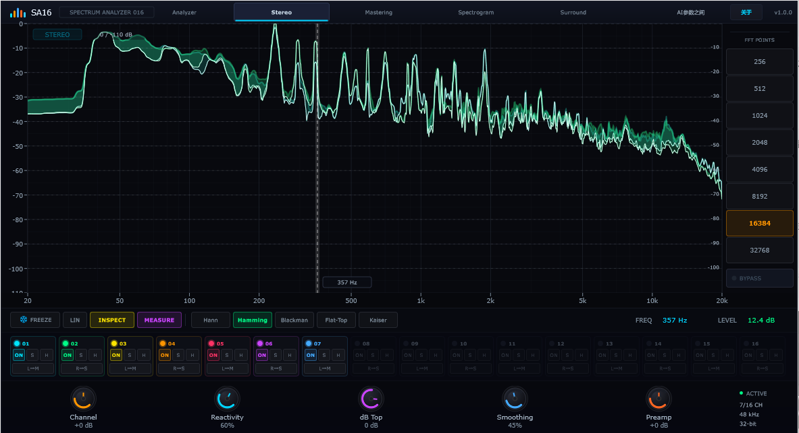
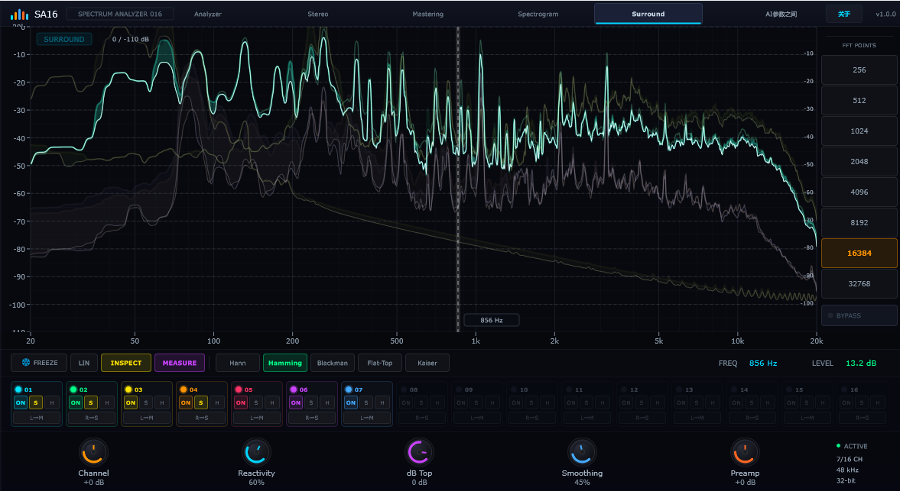
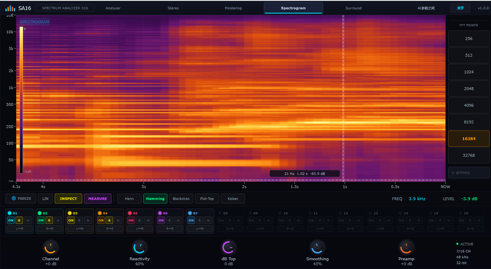

# SA16 Spectrum Analyzer

[中文](README.md) | **English**

[](#)
[](#)
[](#)
[](#)
[](#)
[](#)
[](#)
[](#)

**Author: AI参数之间** · 16-channel real-time spectrum / spectrogram analyzer VST3 plugin

## Introduction

SA16 Spectrum Analyzer is a multi-channel spectrum analyzer plugin for DAW hosts. It provides real-time spectrum traces, peak hold, and a spectrogram view for up to 16 input channels, with view modes including Analyzer, Stereo, Mastering, Spectrogram, and Surround.

The display covers **20 Hz – 20 kHz** (limited by Nyquist), with amplitude down to **-110 dB** by default. It supports log / linear frequency axes, a draggable dB view ceiling, and oscilloscope-style smooth trace rendering.

## UI Preview

<table>
  <tr>
    <td align="center" width="50%"><br/><b>Analyzer</b></td>
    <td align="center" width="50%"><br/><b>Stereo</b></td>
  </tr>
  <tr>
    <td align="center" width="50%"><br/><b>Surround</b></td>
    <td align="center" width="50%"><br/><b>Spectrogram</b></td>
  </tr>
</table>

## Features

- **16-channel analysis**: Per-channel On / Solo / Hold with peak indicators
- **View modes**: Analyzer, Stereo, Mastering, Spectrogram, Surround
- **FFT sizes**: 256 – 32768 (8 steps), multiple windows (Hann / Hamming / Blackman / Flat-Top / Kaiser)
- **Scope-style traces**: Dense sampling + low-frequency smoothing with phosphor afterglow
- **Pro spectrogram**: Time × frequency heat map (Inferno palette); Inspect readout for Hz / time / dB
- **Interaction**: Freeze, LIN frequency, Inspect, Measure, drag / wheel dB Top
- **Bottom knobs**: Channel Gain, Reactivity, dB Top, Smoothing, Preamp

## Build Instructions

### Requirements

- Windows x64
- CMake ≥ 3.22
- Visual Studio 2022
- [JUCE 8.0.6](https://juce.com/) placed as a sibling directory (`../JUCE-8.0.6`)

### Build Release

```powershell
cmake -B build -G "Visual Studio 17 2022" -A x64
cmake --build build --config Release
```

### Output Paths

| Format | Path |
|--------|------|
| Standalone | `build/SA16Spectrum_artefacts/Release/Standalone/SA16 Spectrum Analyzer.exe` |
| VST3 | `build/SA16Spectrum_artefacts/Release/VST3/SA16 Spectrum Analyzer.vst3` |

`COPY_PLUGIN_AFTER_BUILD` is enabled; Release builds attempt to copy into `D:/work/audio/vt3/VST3`. If the DAW is locking the plugin, close the host and rebuild / copy again.

Copy the `.vst3` bundle to your host's plugin folder and rescan plugins in your DAW.

## Project Structure (Overview)

```
Spectrum Analyzer 16ch/
  CMakeLists.txt
  Source/
    Constants.h              # layout constants, freq/dB mapping, FFT sizes
    PluginProcessor.*        # APVTS parameters, bus, engine sync
    PluginEditor.*           # main UI layout and axes
    MainStandalone.cpp       # custom Standalone entry
    DSP/SpectrumEngine.*     # FFT, window, smoothing, phosphor, snapshot
    UI/
      SpectrumDisplay.*      # spectrum traces / spectrogram painting
      NeonKnob.*             # rotary knobs
      ChannelStrip.*         # channel strip
      NeonButtonLnf.h        # neon button LookAndFeel
      AboutDialog.h          # About dialog
  Docs/                      # documentation assets
```

## Main Parameters

| Parameter ID | Description |
|--------------|-------------|
| `fft_size` | FFT size |
| `window` | Window type |
| `smoothing` | Temporal smoothing |
| `reactivity` | Attack / release response |
| `channel_gain` | Channel gain |
| `preamp` | Preamp gain |
| `zoom` | dB view top (dB Top) |
| `linear` | Linear frequency axis |
| `freeze` / `bypass` | Freeze / bypass |

## Dependencies & License

- UI / plugin framework: [JUCE](https://juce.com/)

Please comply with the original license terms of all dependencies when using or distributing this project.

---

## Contact & Follow

- Author: **AI参数之间**
- Email: [zpan477@gmail.com](mailto:zpan477@gmail.com)

Follow our WeChat official account **「AI参数之间」** for more audio and plugin content:

<p align="center">
  
</p>

<p align="center"><b>Scan to follow · WeChat 「AI参数之间」</b></p>
